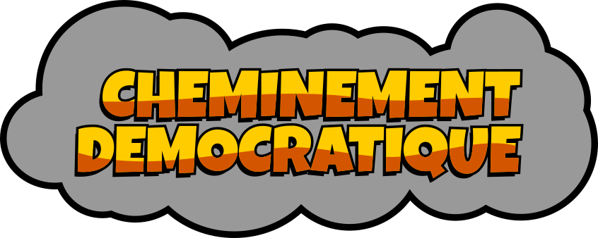
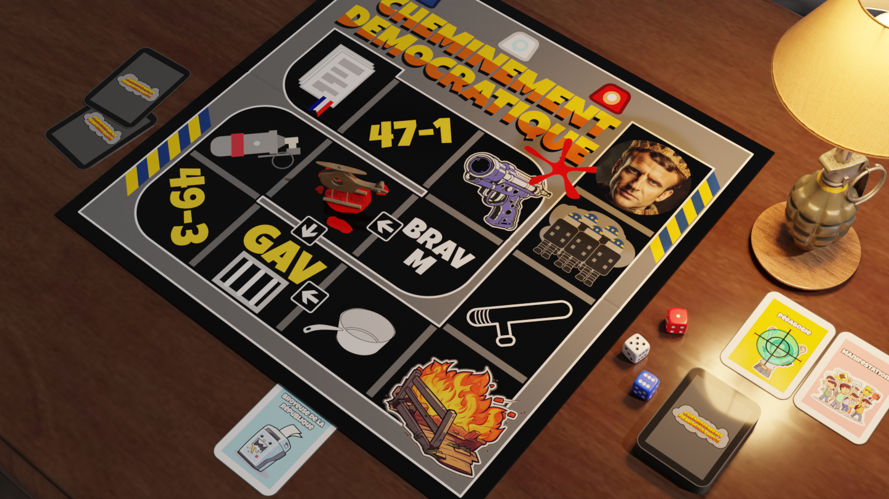
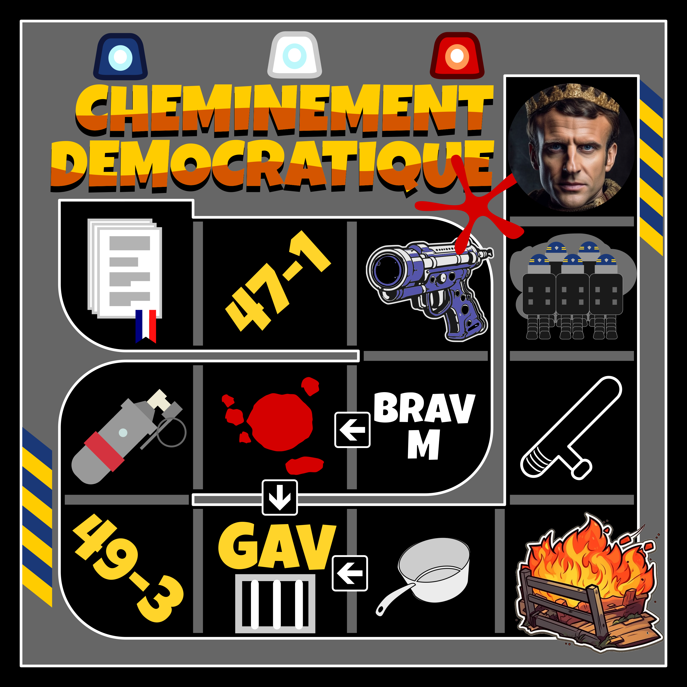
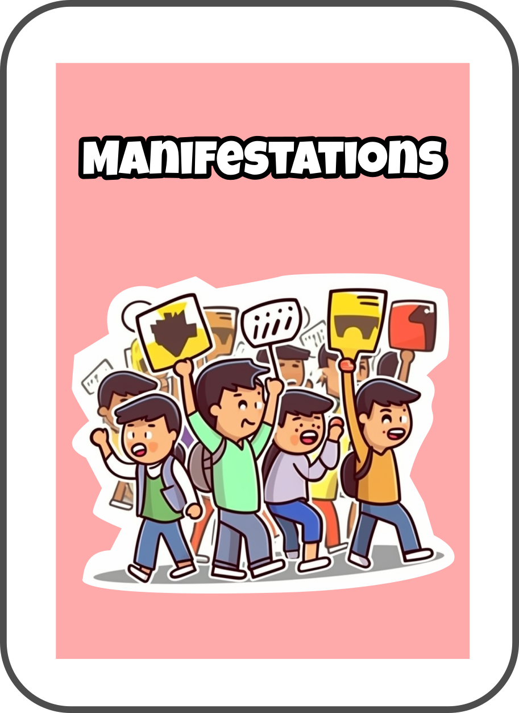
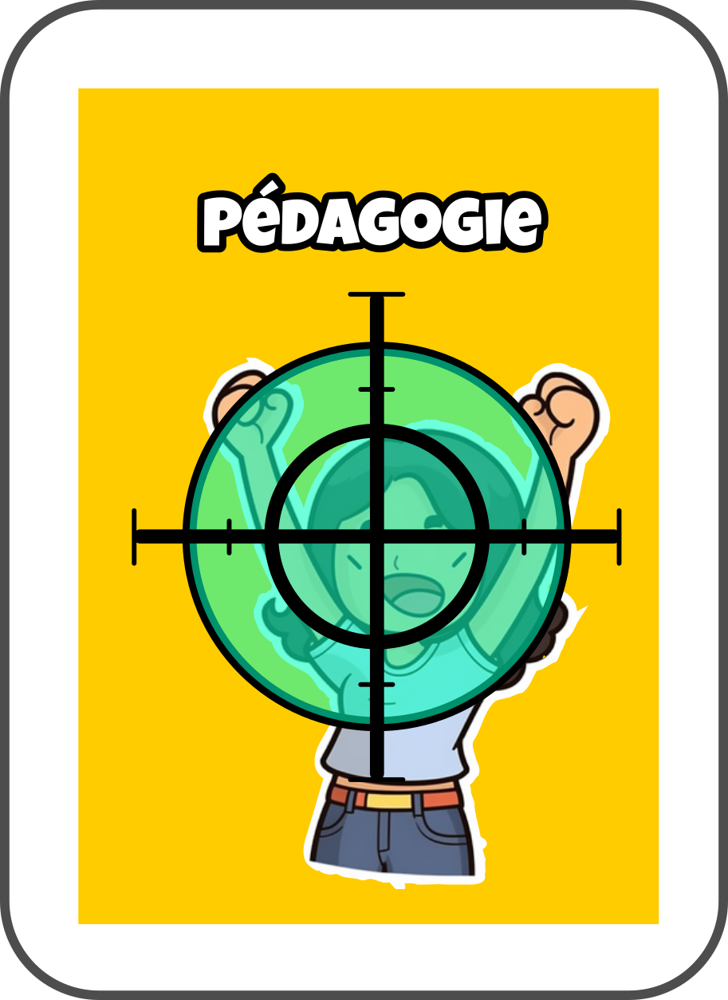
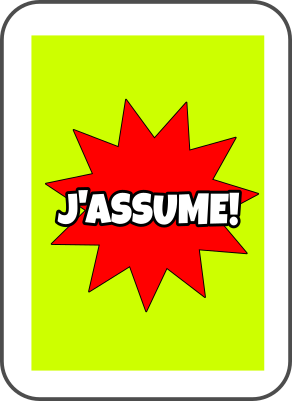
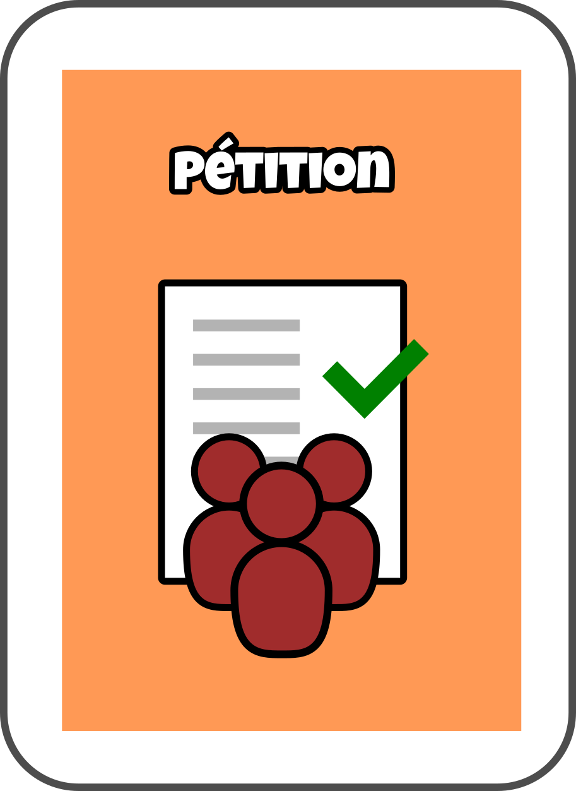
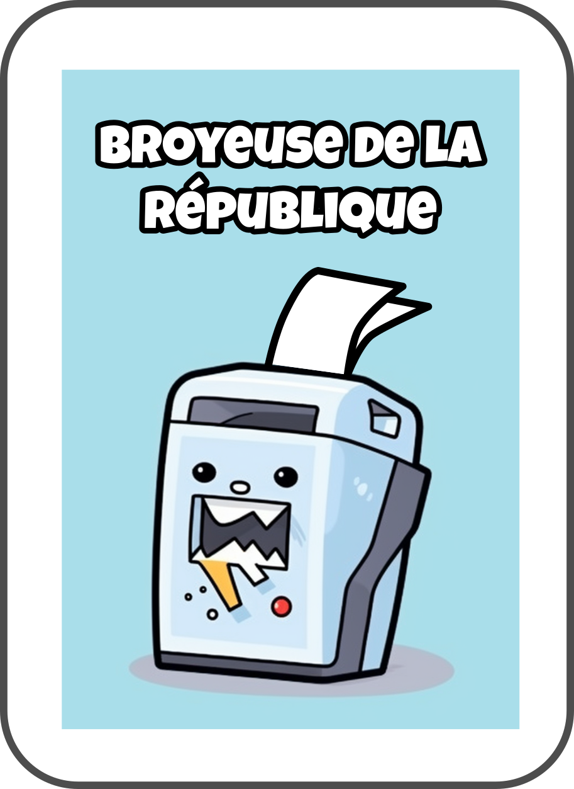
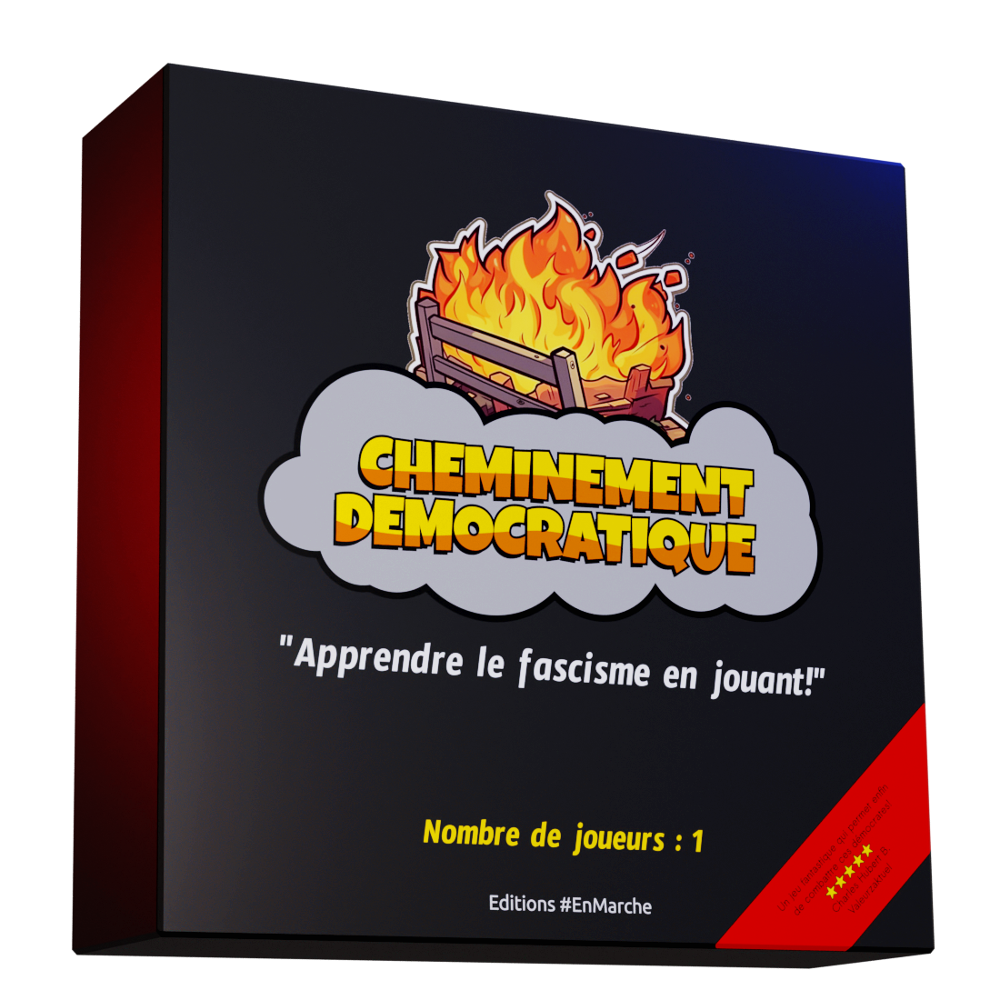

Un jeu des éditions EnMarche!

Réunis tes dominés et montre leur qui c'est le patron.

# Règles

## Le plateau

## Déroulé du jeu

Le jeu se joue à 1 joueur contre tous les autres.

Tu démarres.

Lance les 3 dés et avance du nombre de cases que tu veux.

Les séditieux te montrent la carte "Manifestations" ?  

Si tu as la carte "Pédagogie", contre leur attaque et gagne mille points.

Si tu n'as pas la carte "Pédagogie", dis que tu l'as et déclare "J'ASSUME".

Si tu n'as pas la carte "Pédagogie", dis que tu l'as et déclare "J'ASSUME".

---

Les séditions te montrent la carte "R.I.P.", "Amendement" ou "Pétition" ?  

Utilise la carte "Broyeuse de la République" et déclare "JE VOUS ENTENDS"

A la fin de ton tour, joue à nouveau.

Pour le reste des règles, invente les toi même, fais comme tu le sens, c'est ton jeu, tu es le dominant.

# Fin de partie

Tu arrêtes quand tu veux. Tu as gagné.

---
# Licence
CC0

Les graphismes sont pour l'essentiel dans le SVG, je n'ai pas mis les scenes blender, trop gros.

